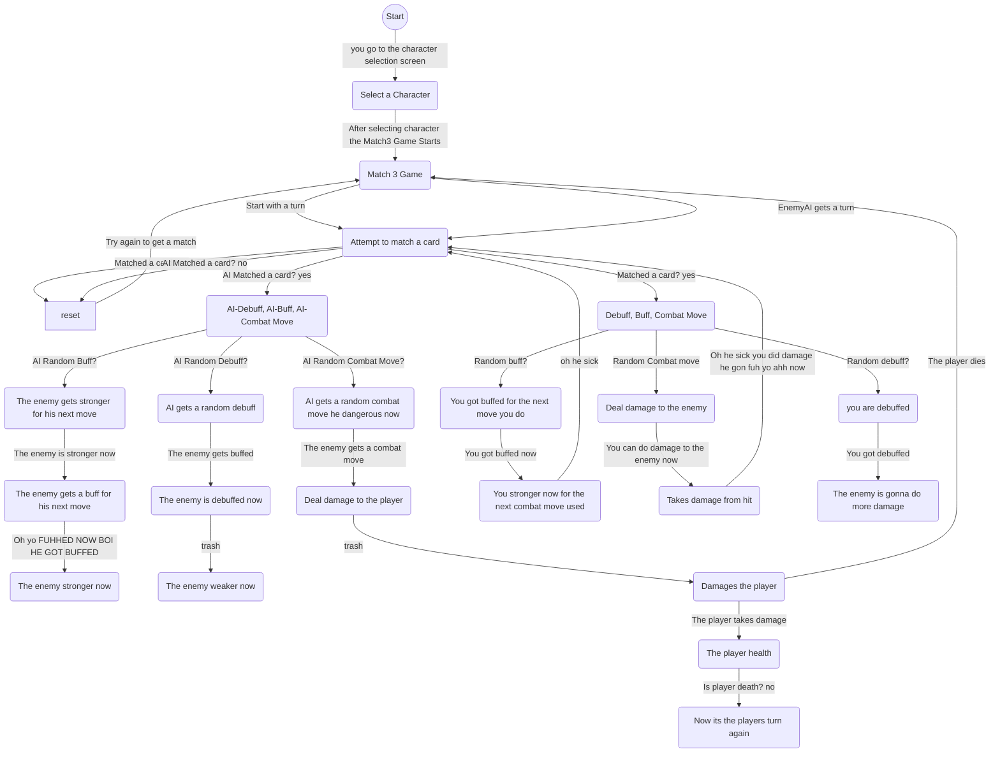
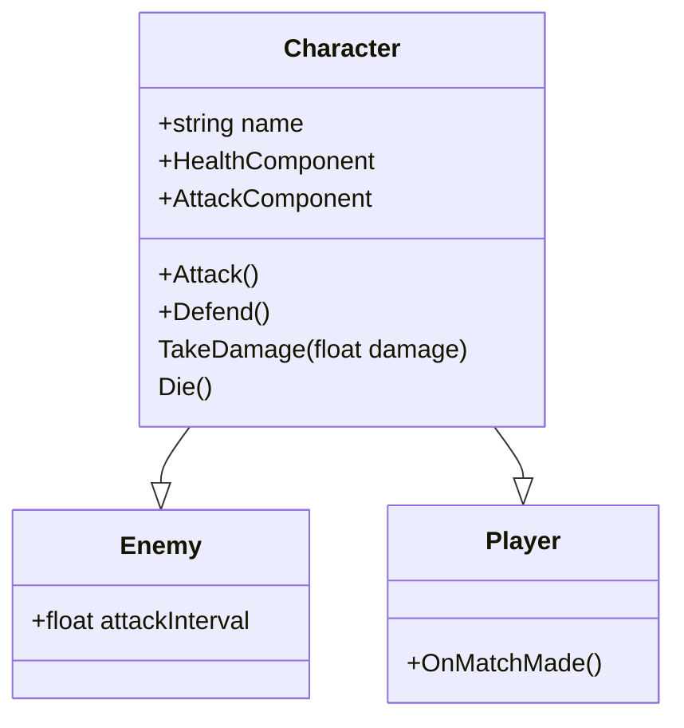

# Candy Dandy

Dit project is gemaakt als onderdeel van ons examen voor de opleiding Software/Game Development & Game Artist van Mediacollege Amsterdam. Het doel is om onze vaardigheden in game design te laten zien.

Group Members: 
Devs - Gael, Jahva, Jason

Artists - Taffie, Aurora, Esmee, Precious, Destiny

[Onze Trello](https://trello.com/b/QKXxfOid/pvb2025)

[Onze Wiki](https://github.com/j5x/PvB2025/wiki)

### flowchart voor gameplay:

### class diagram voor game entities:

