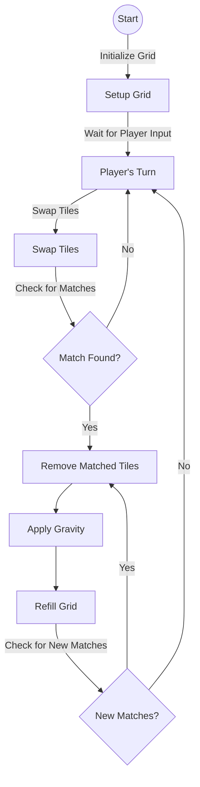
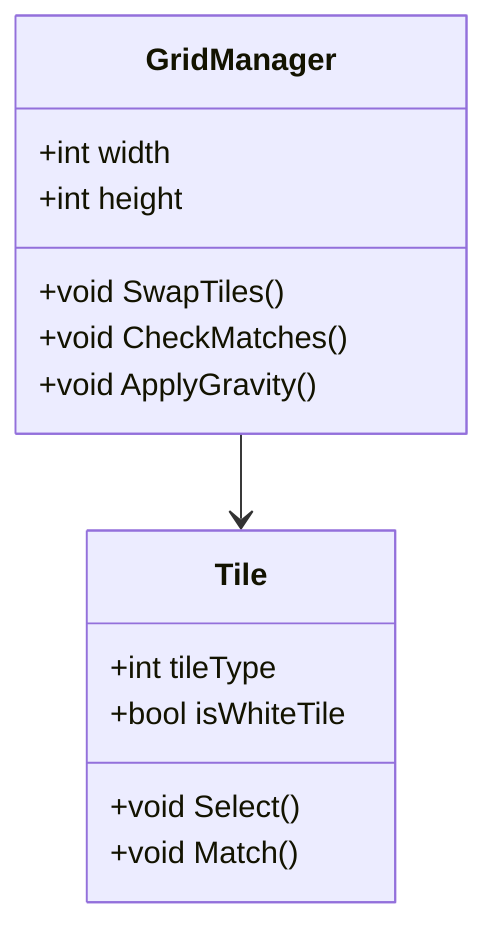
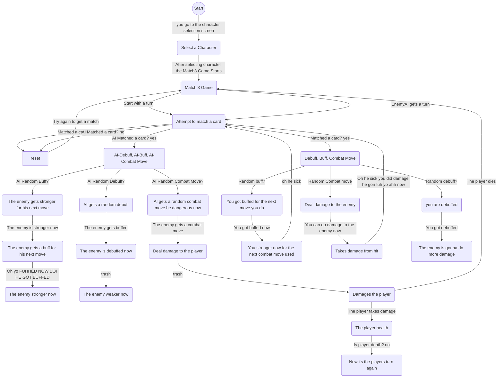
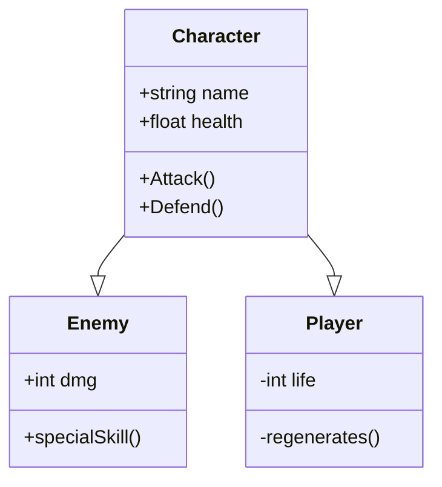

# VoorbeeldExamenRepo
Een voorbeeld repository voor het examenwerk

In deze repository vind je de informatie over het examen project.

Omschrijf de examenopdracht evt de klant en wat het doel voor de klant is.
Omschrijf ook beknopt wat het idee van je game is. 
Een complete en uitgebreide beschrijving komt in het functioneel ontwerp (onderdeel van de [wiki](https://github.com/erwinhenraat/VoorbeeldExamenRepo/wiki))

# Geproduceerde Game Onderdelen

Geef per teammember aan welke game onderdelen je hebt geproduceerd. Doe dit met behulp van omschrijvingen visual sheets en screenshots.
Maak ook een overzicht van alle onderdelen met een link naar de map waarin deze terug te vinden zijn.

Bijv..

### Student Jason Siegersma:
  * [Match 3 System]()
  * [Some other mechanic X](https://github.com/erwinhenraat/VoorbeeldExamenRepo/tree/master/src/mechanic_x)
  * [Some other mechanic Y](https://github.com/erwinhenraat/VoorbeeldExamenRepo/tree/master/src/mechanic_y)
### Student Jahvairo Monkau:
  * Water Shader
  * [Some textured and rigged model](https://github.com/erwinhenraat/VoorbeeldExamenRepo/tree/master/assets/monsters)

### Student Gael Griffith:
  * [Some beautifull script](https://github.com/erwinhenraat/VoorbeeldExamenRepo/tree/master/src/beautifull)
  * Some other Game object


# Match 3 System - Jason Siegersma

## Overview
This Match-3 system is built using Unity and written in C#. It allows tiles to be swapped, matched, cleared, and refilled dynamically. The system ensures that tiles fall into empty spaces rather than respawning in the same spot. 

A special **white tile** is included, which can match with any color. When matched, it clears all tiles of that color from the grid.

## Features
✅ No pre-existing matches at the start.  
✅ Swappable tiles with valid match detection.  
✅ Tile gravity ensures tiles fall into empty spaces.  
✅ Grid automatically refills after matches.  
✅ Special **white tile** that clears all of one color when matched.  

---

## 🔹 Scripts Included

### 1. `GridManager.cs`
**Responsibilities:**
- Initializes the grid with random tiles.
- Ensures no matches are present at the start.
- Handles tile swapping and match detection.
- Applies gravity so tiles fall after matches.
- Refills the grid when tiles are cleared.

**Key Variables:**
```csharp
[SerializeField] private int width = 8;
[SerializeField] private int height = 8;
[SerializeField] private float tileSize = 1.0f;
```
width and height: Define the grid size.

tileSize: Controls the spacing between tiles.

### 2. Tile.cs
**Responsibilities:**

- Represents individual tiles in the game.
- Handles tile selection, visual feedback, and position updates.
flowchart for Match 3




### flowchart voor gameplay:


### class diagram voor game entities:




## Some other Mechanic Grid Match 3 by Jason Siegersma

Contrary to popular belief, Lorem Ipsum is not simply random text. It has roots in a piece of classical Latin literature from 45 BC, making it over 2000 years old. Richard McClintock, a Latin professor at Hampden-Sydney College in Virginia, looked up one of the more obscure Latin words, consectetur, from a Lorem Ipsum passage, and going through the cites of the word in classical literature, discovered the undoubtable source. Lorem Ipsum comes from sections 1.10.32 and 1.10.33 of "de Finibus Bonorum et Malorum" (The Extremes of Good and Evil) by Cicero, written in 45 BC. This book is a treatise on the theory of ethics, very popular during the Renaissance. The first line of Lorem Ipsum, "Lorem ipsum dolor sit amet..", comes from a line in section 1.10.32.


## Some other Mechanic Y by Jason Siegersma

Contrary to popular belief, Lorem Ipsum is not simply random text. It has roots in a piece of classical Latin literature from 45 BC, making it over 2000 years old. Richard McClintock, a Latin professor at Hampden-Sydney College in Virginia, looked up one of the more obscure Latin words, consectetur, from a Lorem Ipsum passage, and going through the cites of the word in classical literature, discovered the undoubtable source. Lorem Ipsum comes from sections 1.10.32 and 1.10.33 of "de Finibus Bonorum et Malorum" (The Extremes of Good and Evil) by Cicero, written in 45 BC. This book is a treatise on the theory of ethics, very popular during the Renaissance. The first line of Lorem Ipsum, "Lorem ipsum dolor sit amet..", comes from a line in section 1.10.32.


## Water Shader by Jahvairo Monkau

Contrary to popular belief, Lorem Ipsum is not simply random text. It has roots in a piece of classical Latin literature from 45 BC, making it over 2000 years old. Richard McClintock, a Latin professor at Hampden-Sydney College in Virginia, looked up one of the more obscure Latin words, consectetur, from a Lorem Ipsum passage, and going through the cites of the word in classical literature, discovered the undoubtable source. Lorem Ipsum comes from sections 1.10.32 and 1.10.33 of "de Finibus Bonorum et Malorum" (The Extremes of Good and Evil) by Cicero, written in 45 BC. This book is a treatise on the theory of ethics, very popular during the Renaissance. The first line of Lorem Ipsum, "Lorem ipsum dolor sit amet..", comes from a line in section 1.10.32.


## Some textured and rigged model by Jahvairo Monkau

Contrary to popular belief, Lorem Ipsum is not simply random text. It has roots in a piece of classical Latin literature from 45 BC, making it over 2000 years old. Richard McClintock, a Latin professor at Hampden-Sydney College in Virginia, looked up one of the more obscure Latin words, consectetur, from a Lorem Ipsum passage, and going through the cites of the word in classical literature, discovered the undoubtable source. Lorem Ipsum comes from sections 1.10.32 and 1.10.33 of "de Finibus Bonorum et Malorum" (The Extremes of Good and Evil) by Cicero, written in 45 BC. This book is a treatise on the theory of ethics, very popular during the Renaissance. The first line of Lorem Ipsum, "Lorem ipsum dolor sit amet..", comes from a line in section 1.10.32.


## Health System Script by Gael Griffith


* ✅ Initializes health based on HealthConfig.
* ✅ Allows an entity to take damage and apply damage multipliers.
* ✅ Allows an entity to heal without exceeding max health.
* ✅ Enables health regeneration if configured.
* ✅ Stops regeneration upon death and triggers the OnDeath event.
* ✅ Supports temporary buffs for max health, damage resistance, and regen rate.
* ✅ Uses events to notify other scripts (e.g., UI updates).
* This script makes health modular, meaning you can apply it to different characters (players, enemies, bosses) with unique stats simply by assigning a different HealthConfig. 💪🔥


## Some other Game object by Gael Griffith

Contrary to popular belief, Lorem Ipsum is not simply random text. It has roots in a piece of classical Latin literature from 45 BC, making it over 2000 years old. Richard McClintock, a Latin professor at Hampden-Sydney College in Virginia, looked up one of the more obscure Latin words, consectetur, from a Lorem Ipsum passage, and going through the cites of the word in classical literature, discovered the undoubtable source. Lorem Ipsum comes from sections 1.10.32 and 1.10.33 of "de Finibus Bonorum et Malorum" (The Extremes of Good and Evil) by Cicero, written in 45 BC. This book is a treatise on the theory of ethics, very popular during the Renaissance. The first line of Lorem Ipsum, "Lorem ipsum dolor sit amet..", comes from a line in section 1.10.32.


